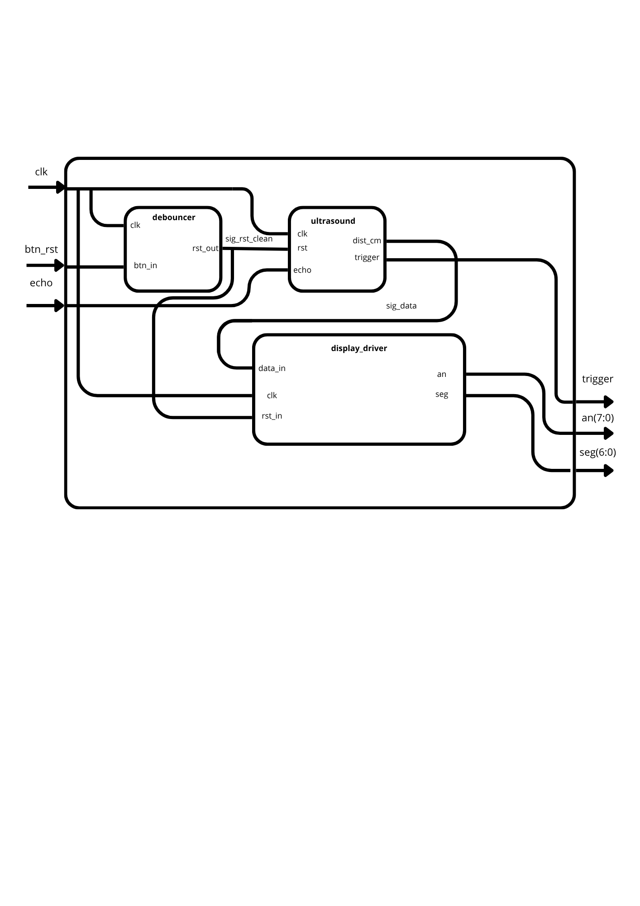

# DE1_projekt_2026
# Ultrasonic Distance Measurement (HC-SR04, VHDL)

## Project Description

This project implements an ultrasonic distance measurement system using the HC-SR04 sensor on an FPGA board. The system measures the duration of the echo signal and determines the distance to an object.

The design is implemented in VHDL as a synchronous digital circuit.

---

## Functionality

1. A trigger pulse is generated to start the measurement.
2. The ultrasonic sensor sends a signal and sets the echo signal HIGH.
3. The system measures how long the echo signal remains HIGH.
4. This time is used to estimate distance.
5. The result is displayed on a 7-segment display.

---

## Top-Level Interface

| Signal | Direction | Width | Description                |
| ------ | --------- | ----- | -------------------------- |
| clk    | input     | 1     | System clock               |
| rst    | input     | 1     | Reset signal               |
| echo   | input     | 1     | Echo signal from sensor    |
| trig   | output    | 1     | Trigger signal to sensor   |
| seg    | output    | 7     | 7-segment display segments |
| an     | output    | 4     | Digit enable               |

---

## Block Diagram

The design consists of interconnected logical blocks as shown in the provided diagram.

Each block processes signals and passes results to the next stage.

---

## Modules

### 1. Debouncer

Removes noise from the mechanical button input.

Inputs:

* clk
* btn

Outputs:

* btn_clean

---

### 2. Ultrasound

Core module that controls the ultrasonic sensor and performs measurement.

Functions:

* generates trigger signal
* measures echo signal duration
* processes measured value

Inputs:

* clk
* rst
* echo
* btn_clean

Outputs:

* trig
* distance [15:0]

---

### 3. Display Driver

Displays the measured distance on a 7-segment display.

Inputs:

* clk
* distance [15:0]

Outputs:

* seg [6:0]
* an [3:0]

---

## Internal Signals

| Signal    | Width | Description             |
| --------- | ----- | ----------------------- |
| btn_clean | 1     | Debounced button signal |
| distance  | 16    | Measured distance value |

---

---

## Internal Signals

| Signal         | Width | Description            |
| -------------- | ----- | ---------------------- |
| count          | 16    | Measured echo duration |
| distance       | 8     | Value used for display |
| enable_counter | 1     | Enables counting       |
| start          | 1     | Start measurement      |
| stop           | 1     | Stop measurement       |

---

## Notes

!Edit schematu!
Pridat simulace 
Popis design souboru 

---
